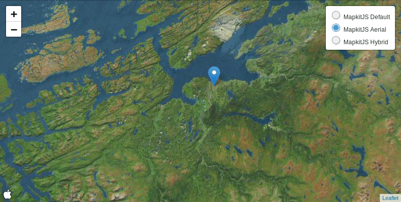

# Leaflet.MapkitMutant

A [LeafletJS](http://leafletjs.com/) plugin to use [Apple's mapkitJS](https://developer.apple.com/documentation/mapkitjs) basemaps.

The name comes from [GoogleMutant](https://gitlab.com/IvanSanchez/Leaflet.GridLayer.GoogleMutant). It's catchy, even if MapkitMutant doesn't use DOM mutation observers.

I do not have any authorization tokens, so there's no live demo for this
(hint hint: somebody please provide me with one). Instead, marvel at this gif:



## Usage

Include the mapkitJS API in your HTML, plus Leaflet:

```html
<script src="https://cdn.apple-mapkit.com/mk/5.x.x/mapkit.js"></script>
<link rel="stylesheet" href="https://unpkg.com/leaflet@1.3.3/dist/leaflet.css" />
<script src="https://unpkg.com/leaflet@1.3.3/dist/leaflet.js"></script>
```

Include the MapkitMutant javascript file:

```html
<script src='https://unpkg.com/leaflet.mapkitmutant@latest/Leaflet.MapkitMutant.js'></script>
```

Then, you can create an instance of `L.GridLayer.MapkitMutant` on your JS code:

```javascript
var roads = L.mapkitMutant({
	// valid values for 'type' are 'default', 'satellite' and 'hybrid'
	type: 'hybrid',

	authorizationCallback: function(done) {
		done("Your authorization token goes here")
	},
	language: 'en',

	// For debugging purposes only. Displays a L.Rectangle on the
	// visible bounds ("region") of the mutant.
	debugRectangle: false
}).addTo(map);
```


## Known issues

* "I only see a rectangle when zooming out"

This happens because MapkitJS has a very particular behaviour for very low
zoom levels: it will refuse to use the given `CoordinateSpan` if that would
mean displaying over 180 degrees of longitude or so.

The current workaround is to scale down the size of the MapkitMutant so it overlaps
the region it reports to cover.

In practical terms, this means that users should add `minZoom: 3` to their maps
(or set the `maxBounds` of the map to something less than 180 degrees of longitude,
or any other similar approach). Else, users will not see parts of the map as grey.


* "I want routing, and placename search, and traffic, and streetview"

Nope. this plugin is **only** for the mapkitjs basemaps. It doesn't provide
routing, nor search, nor POIs. If you want that, consider implementing it
yourself.

## Legalese

Licensed under LGPL3. Because why not. See the LICENSE file for details.

